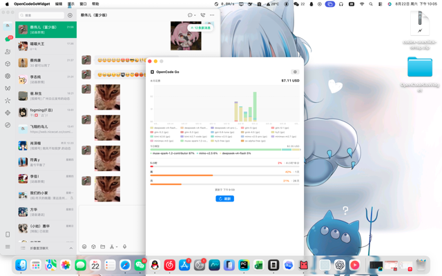
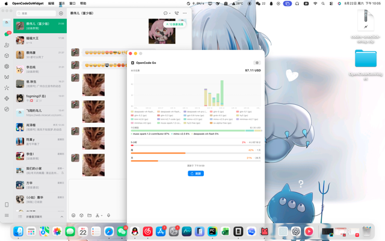
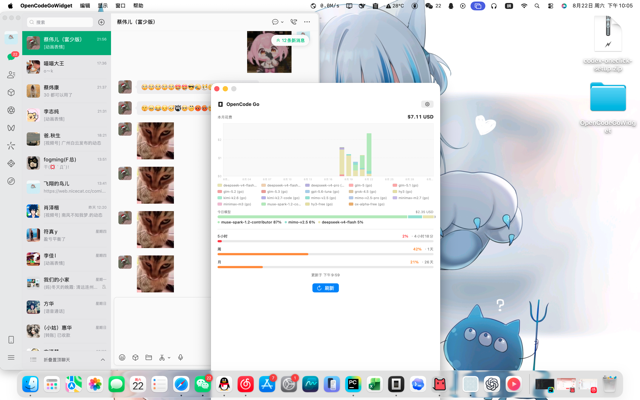

# OpenCode Go 套餐查看器

> macOS 原生小组件 + 仪表盘 · 实时查看 OpenCode Go 额度与按日按模型花费

<p align="center">
  <a href="https://github.com/Steve233333/OpenCodeGoWidget/releases/latest">
    
  </a>
  
  
  
  
</p>

<p align="center">
  <a href="https://github.com/Steve233333/OpenCodeGoWidget/releases/latest/download/OpenCodeGoWidget-1.0.dmg">
    
  </a>
  &nbsp;
  <a href="https://github.com/Steve233333/OpenCodeGoWidget/releases/latest/download/OpenCodeGoWidget-1.0.zip">
    
  </a>
</p>

<p align="center">
  <b>一键下载 → 拖入「应用程序」→ 打开即用</b><br/>
  <sub>支持 Apple Silicon / Intel · 无需 Homebrew · 沙盒安全</sub>
</p>

---

## ✨ 这是什么

**OpenCode Go 套餐查看器** 是为 [opencode.ai](https://opencode.ai) Go 套餐用户做的 macOS 轻量查看器，解决官网只能网页查额度、无法常驻看花费的痛点。

- **桌面小组件**常驻：5 小时 / 周 / 月三档额度进度 + 近 7 天堆叠花费（仅点击柱状图进主 App，点其他区域不跳转）
- **主 App 仪表盘**固定窗口 `620×860`：本月 `31 天`完整堆叠柱（空日留空不塌陷）、图例按模型分色、今日模型细分、实时刷新
- **真数据**：通过 workspace 维度拉取 `/_server` 全量 `totalCost`（`1e-8` 美元累加），与官网 Usage 页 `Tooltip` 一致，而非假数据占位

## 📸 预览

| 主 App（固定窗口） | 设置（HAR 一键导入） | 桌面小组件（中尺寸） |
|---|---|---|
|  |  |  |

> 图片为 `v1.0` 实机截图：本月 `$7.11 USD`、近 7 天 `$7.11 USD`、今日模型 `muse-spark 87%` 等与线上一致

## 🚀 30 秒快速开始

### 方式一：DMG（推荐）
1. 点击顶部 <b>DMG 安装包</b> 绿色按钮下载 `OpenCodeGoWidget-1.0.dmg`
2. 双击 DMG → 把 `OpenCodeGoWidget.app` 拖入 `Applications`
3. `open /Applications/OpenCodeGoWidget.app` 首次启动自动注册**开机自启**（可在 `设置` 关闭或 `系统设置 → 通用 → 登录项` 管理）

### 方式二：ZIP 免安装
1. 下载 `OpenCodeGoWidget-1.0.zip` → 解压得 `OpenCodeGoWidget.app`
2. 双击运行即可，无需安装

### 首次配置（2 分钟）

1. **API Key**：打开 App → 右上 `⚙︎` → 粘贴 `opencode.ai → Settings → API Keys` 复制的 `sk-...` → 保存
   - 密钥存于系统 `Keychain` + `App Group`，仅本地使用，更新后小组件自动同步
2. **柱状图真数据（可选但推荐）**：
   - 在 `opencode.ai` 打开你的 `workspace/usage` 页 → 浏览器 `导出 HAR` 保存到桌面 → 回到 App 设置点 `选择 HAR 文件` → 自动提取 `wrk_...` 与 `539B auth Cookie` 存入 `App Group`，柱状图即显示 **31 天堆叠真数据**
   - 也可直接粘贴 `https://opencode.ai/workspace/wrk_.../usage` 全链路或裸 `wrk_...` + `auth`，保存时同自动解析，无需手动复制
3. **添加到桌面**：`桌面右键 → 编辑小组件 → 搜索 OpenCode Go → 添加中尺寸` → 已自动显示近 7 天图表（点柱状图进主 App，点 `↻` 刷新）

> 未配置 workspace 时，App 与小组件仅显示三档额度与“暂无费用”占位，不报错

## 🔧 功能一览

- **额度**：`5 小时 / 周 / 月` 百分比 + 剩余重置时间（`· 4小时59分 / · 1天 / · 26天`），低于 `20%` 红、`50%` 橙
- **花费**：本月总额 `USD`、今日总额 `USD`、今日模型横向堆叠（`Top3 + 其他` 灰）、`17` 模型统一淡色系与图例同色
- **图表**：App `Charts` 整月连续轴 `xDomain = 01-31` 空日透明占位不塌陷；小组件 `GeometryReader` 近 7 天等宽柱 `42 高 + 11 高日期`
- **交互**：小组件 **仅柱状图可点** 跳转 `opencodego://month` 单例主窗（`Window id:main + handlesExternalEvents`），刷新按钮 `28pt` 圆命中扩大防误触
- **窗口**：主 App `windowResizability(.contentSize) 620×860 fixedSize` 固定卡片，`onOpenURL` 激活唯一窗口

## 📦 下载直链（免翻 Releases 页）

- **DMG**: https://github.com/Steve233333/OpenCodeGoWidget/releases/latest/download/OpenCodeGoWidget-1.0.dmg
- **ZIP**: https://github.com/Steve233333/OpenCodeGoWidget/releases/latest/download/OpenCodeGoWidget-1.0.zip
- **历史版本**: https://github.com/Steve233333/OpenCodeGoWidget/releases

> 若浏览器提示“未验证开发者”，`右键 → 打开` 首次允许即可（`Codex Patched Signing` 自签名，`--options runtime`）

## 🛠️ 本地构建

```bash
git clone https://github.com/Steve233333/OpenCodeGoWidget.git
cd OpenCodeGoWidget
./build.sh
# 产物
# build/OpenCodeGoWidget.app
# dist/OpenCodeGoWidget-1.0.dmg  dist/OpenCodeGoWidget-1.0.zip
open /Applications/OpenCodeGoWidget.app
```

- 依赖：`Xcode Command Line Tools + swiftc + MacOSX SDK 14.0+`，无需 `SPM / CocoaPods`
- 签名：优先 `Codex Patched Signing`，缺失则 `ad-hoc`

## ❓ 常见问题

**小组件不出现？** `系统设置 → 桌面与程序坞 → 小组件` 确保已启用；`killall WidgetKit` 后重加

**柱状图一直“暂无”？** 检查设置中 `wrk_...` 为裸 ID（非全 URL）且 `auth` 为 `539B`，重新选一次 HAR 保存

**点小组件其他区域也进 App？** 已修复为仅柱状图 `56 高` 矩形可点，其他区域 `contentShape` 已收紧

**刷新要按很准？** `v1.0` 已扩 `28pt` 圆命中并置顶 `zIndex`，点 `↻` 外沿亦可

**如何关闭开机启动？** App `设置 → 开机自动启动` 关，或 `系统设置 → 通用 → 登录项 → 移除`

## 🔐 隐私

- 仅本地读取 `zen_api_key`（`Keychain`）与 `workspaceID/authCookie`（`App Group 2DC432GLL2.com.steve233.opencodego`）
- 网络仅 `GET https://opencode.ai/zen/go/v1/usage` 与 `POST https://opencode.ai/_server`（带 `X-Server-Id` 分层重试），无第三方上报
- `100_000_000` 除数与 `1e-8` 美元语义已按 `HAR 539B` 实测校准

## 📄 开源

MIT License · 欢迎 Issue / PR · `opencode go 套餐查看器` 独立社区项目，与 `OpenCode` 官方无关

---

<p align="center"><sub>Built with SwiftUI + Charts + WidgetKit · 固定窗口 620×860 · 支持 macOS 14.0+</sub></p>
